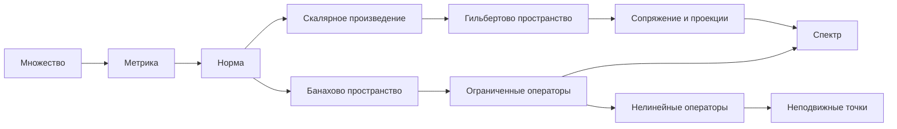

# Функциональный анализ — карта курса

Функциональный анализ изучает пространства функций и операторы между ними. Для искусственного интеллекта это язык, на котором конечномерная линейная алгебра продолжается к функциям, распределениям, ядрам, интегральным операторам, динамическим системам и неявным моделям.

## Маршрут из 13 модулей

1. [[30_mathematics/functional-analysis/modules/01-sets-spaces-maps|Множества, пространства и отображения]].
2. [[30_mathematics/functional-analysis/modules/02-metric-normed-spaces|Метрические и нормированные пространства]].
3. [[30_mathematics/functional-analysis/modules/03-measure-lebesgue-lp|Мера Лебега, интеграл и Lp]].
4. [[30_mathematics/functional-analysis/modules/04-compactness|Компактность]].
5. [[30_mathematics/functional-analysis/modules/05-topological-weak-view|Топологический и слабый ракурс]].
6. [[30_mathematics/functional-analysis/modules/06-linear-operators|Линейные операторы в нормированных пространствах]].
7. [[30_mathematics/functional-analysis/modules/07-hilbert-operators|Операторы в гильбертовых пространствах]].
8. [[30_mathematics/functional-analysis/modules/08-distributions-convolution|Обобщённые функции и свёртка]].
9. [[30_mathematics/functional-analysis/modules/09-operator-equations|Операторные и фредгольмовы уравнения]].
10. [[30_mathematics/functional-analysis/modules/10-spectral-theory|Спектральная теория]].
11. [[30_mathematics/functional-analysis/modules/11-nonlinear-frechet|Нелинейные операторы и производная Фреше]].
12. [[30_mathematics/functional-analysis/modules/12-positive-operators|Положительные операторы и конусы]].
13. [[30_mathematics/functional-analysis/modules/13-dependency-map|Карта определений, теорем и зависимостей]].

## Главная цепочка абстракций

## Проверяемые теоремы

- [[30_mathematics/functional-analysis/theorems/baire-category|Теорема Бэра]].
- [[30_mathematics/functional-analysis/theorems/hahn-banach|Теорема Хана—Банаха]].
- [[30_mathematics/functional-analysis/theorems/uniform-boundedness|Принцип равномерной ограниченности]].
- [[30_mathematics/functional-analysis/theorems/open-mapping|Теорема об открытом отображении]].
- [[30_mathematics/functional-analysis/theorems/closed-graph|Теорема о замкнутом графике]].
- [[30_mathematics/functional-analysis/theorems/riesz-representation|Теорема Рисса о представлении]].
- [[30_mathematics/functional-analysis/theorems/dominated-convergence|Теорема Лебега о мажорируемой сходимости]].
- [[30_mathematics/functional-analysis/theorems/spectral-compact-selfadjoint|Спектральная теорема для компактного самосопряжённого оператора]].
- [[30_mathematics/functional-analysis/theorems/banach-fixed-point|Принцип сжимающих отображений]].
- [[30_mathematics/functional-analysis/theorems/schauder-fixed-point|Принцип Шаудера]].

## Источник и покрытие

Полное соответствие подразделов и страниц находится в [[30_mathematics/functional-analysis/source-map|карте источника]]. Библиографическая карточка: [[60_sources/boss-functional-analysis|В. Босс — Функциональный анализ]].

