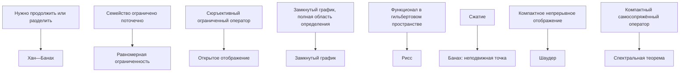

# Модуль 13. Карта определений, теорем и зависимостей

## Результаты обучения

После изучения модуля читатель сможет:

- выбирать пространство и режим сходимости по постановке задачи;
- находить теорему по проверяемым предпосылкам, а не по сходству названий;
- проектировать эксперимент, который способен опровергнуть перенос математической идеи в ИИ.

## Пререквизиты и маршрут зависимостей

пространство → полнота, компактность, непрерывность и замкнутость → подходящая теорема → конечномерная аппроксимация → диагностируемый перенос в ИИ.

## Покрытие источника

Модуль покрывает соответствующую главу учебника Босса на с. 182–204. Постраничное соответствие подразделов сохранено в [[30_mathematics/functional-analysis/source-map|карте источника]].

## Зачем нужна сводка

Функциональный анализ полезен не списком названий, а умением распознать структуру задачи. Этот модуль превращает курс в карту решений: какое пространство выбрать, какую компактность искать, когда допустимо обращение и какая теорема о неподвижной точке действительно помогает.

## 1. Определите пространство

| Вопрос | Возможный выбор | Что получаем |
|---|---|---|
| Нужен контроль наихудшего случая | $C(K)$, $L^\infty$ | равномерная норма, но сложнее двойственность |
| Нужна энергетическая геометрия | $L^2$, гильбертово пространство | ортогональность, проекция, сопряжение |
| Нужна устойчивость ошибки по массе | $L^1$ | банахова геометрия, нет скалярного произведения |
| Нужны производные | пространство Соболева / область оператора | слабые производные и следы |
| Нужен порядок | банахова решётка / конус | положительность и монотонная итерация |

## 2. Проверьте четыре свойства

1. **Полнота:** предел приближения остаётся в пространстве?
2. **Компактность:** можно извлечь сходящуюся подпоследовательность?
3. **Непрерывность и ограниченность:** малое возмущение входа даёт контролируемую ошибку выхода?
4. **Замкнутость:** допустимые пределы сохраняют ограничения и связь, заданную оператором?

## 3. Какую теорему использовать

## 4. Карта переносов в ИИ

- Геометрия и функции потерь → [[50_bridges/metrics-losses]].
- Популяционный риск → [[50_bridges/lp-risk]].
- Ядра → [[50_bridges/hilbert-rkhs]].
- Низкий ранг и спектральный анализ → [[50_bridges/operators-spectrum]].
- CNN и обучение операторов → [[50_bridges/distributions-convolution]].
- Обратные задачи → [[50_bridges/operator-equations]].
- Автоматическое дифференцирование и неявные модели → [[50_bridges/frechet-fixed-points]].
- Марковские и монотонные модели → [[50_bridges/positive-operators]].

## 5. Типичные ошибочные переносы

- «Замкнутое + ограниченное ⇒ компактное» — только в конечномерном нормированном пространстве.
- «Собственные значения описывают оператор» — неверно для ненормального и непрерывного спектра.
- «Градиент — вектор» — только после выбора отображения Рисса и метрики.
- «Неподвижная точка существует ⇒ итерация сходится» — Шаудер этого не даёт.
- «Поточечная сходимость ⇒ сходится математическое ожидание» — нужно доминирование или равномерная интегрируемость.
- «Низкоранговое приближение матрицы ⇒ низкоранговая нелинейная сеть» — требуется оператор и норма, в которых выполняется оценка.

## 6. Экспериментальный протокол

Для каждой связи с ИИ фиксировать:

1. математический объект и пространства;
2. предположения теоремы;
3. конечномерное приближение;
4. наблюдаемая метрика;
5. контрпример или типичный сбой;
6. эксперимент, способный опровергнуть гипотезу.

## Визуализация

## Самопроверка

1. Какое свойство предотвращает выход предела приближений из пространства?
2. Какая теорема даёт существование неподвижной точки, но не скорость итерации?
3. Какие измеряемые величины должны сопровождать исследовательскую гипотезу?

## Упражнения

1. Постройте маршрут от постановки обратной задачи до выбора регуляризации и диагностической невязки.
2. Сравните предпосылки теорем Банаха и Шаудера на одном нелинейном операторе.
3. Выберите один перенос в ИИ и выпишите эксперимент, который может его опровергнуть.

## Итог

Курс завершён на уровне связного материала в статусе проверки. Перед публикацией остаётся визуально сверить формулы и номера утверждений по приватному скану и получить ручное подтверждение `canonical`.

Вернуться: [[10_maps/functional-analysis]] или [[index]].
