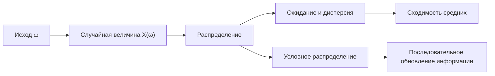

# Модуль 01. Вероятностный минимум: случайность, ожидание и условие

## Результаты обучения

После изучения модуля читатель сможет:

- формулировать вероятностную модель и явно указывать независимость и хвостовые предположения;
- выводить масштаб отклонения и отличать конечновыборочную оценку от предельной эвристики;
- связывать вероятностный результат с обобщением, устойчивостью или спектральной задачей в ИИ.

## Маршрут по курсу и покрытие источника

**Вероятностный минимум: случайность, ожидание и условие** → [[30_mathematics/probability/modules/02-concentration-independent-sums|следующий модуль]]. Постраничное соответствие зафиксировано в [[30_mathematics/probability/probability-source-map|карте источника]].


## Зачем это нужно

В машинном обучении слово «случайность» может означать разные вещи: выбор объекта из генеральной совокупности, шум измерения, случайную инициализацию, разбиение данных или внутреннюю рандомизацию алгоритма. Вероятностная формула имеет смысл только после того, как указан источник случайности и пространство возможных исходов.

Цель модуля — собрать минимальный язык, необходимый для концентрации, статистического риска и RMT.

## Карта зависимостей



Нужны [[30_mathematics/functional-analysis/modules/03-measure-lebesgue-lp|мера, интеграл и пространства Lp]] и [[20_concepts/convergence-modes|виды сходимости]].

## 1. Вероятностное пространство

Вероятностное пространство — тройка

$$
(\Omega,\mathcal F,\mathbb P),
$$

где $\Omega$ — множество исходов, $\mathcal F$ — σ-алгебра наблюдаемых событий, а $\mathbb P$ — вероятностная мера.

Различие между исходом и наблюдаемой величиной принципиально. Например, исходом может быть весь поток измерений датчика, тогда как модель получает только конечное окно и метку отказа.

## 2. Случайная величина как отображение

Случайная величина $X$ — измеримое отображение

$$
X\colon \Omega\to\mathbb R.
$$

Случайный вектор принимает значения в $\mathbb R^d$. Его распределение — образ меры:

$$
\mathbb P_X(A)=\mathbb P\{\omega:X(\omega)\in A\}.
$$

Это позволяет забыть конкретное $\Omega$, если задача зависит только от распределения $X$.

## 3. Ожидание, дисперсия и ковариация

Если $X$ интегрируема,

$$
\mathbb E X=\int_\Omega X(\omega)\,d\mathbb P(\omega).
$$

Дисперсия

$$
\operatorname{Var}(X)
=
\mathbb E(X-\mathbb EX)^2
=
\mathbb EX^2-(\mathbb EX)^2
$$

измеряет средний квадрат отклонения, но не задаёт форму хвоста.

Для случайного вектора $X\in\mathbb R^d$ с $\mu=\mathbb EX$ ковариационная матрица равна

$$
\operatorname{Cov}(X)
=
\mathbb E[(X-\mu)(X-\mu)^T].
$$

Она положительно полуопределена, поскольку

$$
u^T\operatorname{Cov}(X)u
=
\operatorname{Var}\langle u,X\rangle\ge0.
$$

## 4. Независимость

Случайные величины $X_1,\ldots,X_n$ независимы, если для любых борелевских множеств $A_i$

$$
\mathbb P\{X_1\in A_1,\ldots,X_n\in A_n\}
=
\prod_{i=1}^n\mathbb P\{X_i\in A_i\}.
$$

Независимость сильнее нулевой ковариации. Две зависимые величины могут быть некоррелированными.

При независимости интегрируемых функций факторизуются экспоненциальные моменты:

$$
\mathbb E\exp\left(\lambda\sum_iX_i\right)
=
\prod_i\mathbb E e^{\lambda X_i}.
$$

Именно эта формула приводит к [[30_mathematics/probability/theorems/hoeffding-inequality|неравенству Хёффдинга]].

## 5. Условие как доступная информация

Для события $B$ положительной вероятности

$$
\mathbb P(A\mid B)
=
\frac{\mathbb P(A\cap B)}{\mathbb P(B)}.
$$

Условное ожидание $\mathbb E[X\mid\mathcal G]$ относительно σ-алгебры $\mathcal G$ — $\mathcal G$-измеримая случайная величина, удовлетворяющая

$$
\int_G\mathbb E[X\mid\mathcal G]\,d\mathbb P
=
\int_GX\,d\mathbb P
\qquad
\text{для всех }G\in\mathcal G.
$$

Интуитивно это наилучший прогноз $X$ по информации $\mathcal G$ в среднеквадратичном смысле.

Закон полной вероятности и башенное свойство:

$$
\mathbb E\,\mathbb E[X\mid\mathcal G]=\mathbb EX.
$$

## 6. Базовые вероятностные оценки

### Оценка объединения

$$
\mathbb P\left(\bigcup_{i=1}^nA_i\right)
\le
\sum_{i=1}^n\mathbb P(A_i).
$$

Независимость не требуется. Цена — возможная грубость при сильном перекрытии событий.

### Неравенство Маркова

Для $X\ge0$ и $t>0$

$$
\mathbb P\{X\ge t\}\le\frac{\mathbb EX}{t}.
$$

Доказательство следует из $X\ge t\mathbf1_{\{X\ge t\}}$ и монотонности ожидания.

### Неравенство Чебышёва

$$
\mathbb P\{|X-\mathbb EX|\ge t\}
\le
\frac{\operatorname{Var}(X)}{t^2}.
$$

Оно универсально, но полиномиальный хвост часто слишком слаб для высокой размерности.

## 7. Предельные режимы

Закон больших чисел объясняет сходимость среднего

$$
\overline X_n=\frac1n\sum_{i=1}^nX_i
$$

к $\mathbb EX$. Центральная предельная теорема описывает масштаб типичного отклонения:

$$
\sqrt n\,
\frac{\overline X_n-\mu}{\sigma}
\Rightarrow
\mathcal N(0,1).
$$

Предельная теорема не является конечновыборочной гарантией. Она не сообщает точную ошибку при конкретном $n$ без дополнительных условий. Для этого нужны неасимптотические оценки следующего модуля.

## 8. Контрпримеры и режимы отказа

1. **Некоррелированность не означает независимость.** Если $X$ симметрична, то $X$ и $X^2$ могут иметь нулевую ковариацию, оставаясь зависимыми.
2. **Среднее может не существовать.** У распределения Коши выборочное среднее не стабилизируется как в классическом законе больших чисел.
3. **Наблюдения могут быть зависимыми.** Соседние окна одного временного ряда нельзя автоматически считать независимой выборкой.
4. **Условие меняет распределение.** Выбор только успешно завершённых экспериментов создаёт смещение отбора.

## 9. Вычислительный эксперимент

Сравните выборочное среднее нормального распределения и распределения Коши:

```python
import numpy as np

rng = np.random.default_rng(7)
sizes = np.geomspace(10, 100_000, 80).astype(int)
normal_means = [rng.normal(size=n).mean() for n in sizes]
cauchy_means = [rng.standard_cauchy(size=n).mean() for n in sizes]
```

Для нормальных данных траектория стабилизируется; для Коши отдельный выброс способен изменить среднее даже при большом $n$.

## 10. Перенос в ИИ

- **`established`**: эмпирический риск является средним случайных потерь, если данные заданы вероятностной моделью;
- **`analogy`**: условное ожидание можно воспринимать как прогноз при фиксированном информационном интерфейсе;
- **`research hypothesis`**: трактовать случайные мини-пакеты как независимые после сложного адаптивного отбора без анализа зависимости.

## Визуализация


## Самопроверка

1. Какой математический объект является главным в теме «Вероятностный минимум: случайность, ожидание и условие» и в каком пространстве он определён?
2. Какое условие основного утверждения легче всего незаметно нарушить?
3. Какая измеримая величина отличает корректное применение результата от правдоподобной аналогии?

## Упражнения

1. Для бросков монеты явно задайте $\Omega$, $\mathcal F$, $X$ и распределение $X$.
2. Докажите положительную полуопределённость ковариационной матрицы.
3. Постройте зависимые, но некоррелированные величины.
4. Объясните, почему перекрывающиеся временные окна нарушают независимость.
5. Назовите источник случайности в конкретном эксперименте с нейронной сетью.

## Источники и связи

- [[60_sources/vershynin-high-dimensional-probability|Вершинин]], разделы 1.3–1.8, стр. 10–24.
- [[30_mathematics/probability/modules/02-concentration-independent-sums|Следующий модуль: концентрация сумм]].
