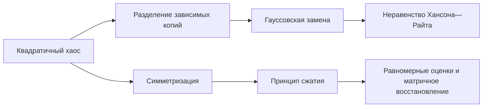

# Модуль 06. Квадратичные формы, симметризация и сжатие

## Результаты обучения

После изучения модуля читатель сможет:

- формулировать вероятностную модель и явно указывать независимость и хвостовые предположения;
- выводить масштаб отклонения и отличать конечновыборочную оценку от предельной эвристики;
- связывать вероятностный результат с обобщением, устойчивостью или спектральной задачей в ИИ.

## Маршрут по курсу и покрытие источника

[[30_mathematics/probability/modules/05-concentration-without-independence|предыдущий модуль]] → **Квадратичные формы, симметризация и сжатие** → [[30_mathematics/probability/modules/07-random-processes-gaussian-width|следующий модуль]]. Постраничное соответствие зафиксировано в [[30_mathematics/probability/probability-source-map|карте источника]].


## Зачем это нужно

Линейная форма $\langle a,X\rangle$ измеряет одно направление. Квадратичная форма

$$
X^TAX
$$

описывает энергию, расстояние Махаланобиса, дисперсию проекции, графовый разрез и ошибку ковариации. Её слагаемые $X_iX_j$ зависимы даже при независимых координатах $X_i$, поэтому прежние неравенства для сумм нельзя применять напрямую.

## Карта зависимостей



## 1. Два масштаба матрицы

В неравенстве для квадратичной формы возникают

$$
\|A\|_F
=
\left(\sum_{i,j}A_{ij}^2\right)^{1/2},
\qquad
\|A\|
=
\sup_{\|x\|_2=1}\|Ax\|_2.
$$

Первая норма агрегирует множество слабых направлений, вторая выделяет одно самое сильное. Поэтому хвост имеет два режима.

## 2. Разделение зависимостей

Вне диагонали

$$
\sum_{i\ne j}A_{ij}X_iX_j
$$

одна и та же координата участвует во многих произведениях. Разделение (decoupling) заменяет одну копию $X$ независимой копией $X'$:

$$
X^TAX
\rightsquigarrow
X^TAX'.
$$

Это не равенство случайных величин, а контролируемое сравнение их экспоненциальных моментов.

## 3. Неравенство Хансона—Райта

Для независимых центрированных субгауссовских координат с

$$
K=\max_i\|X_i\|_{\psi_2}
$$

[[30_mathematics/probability/theorems/hanson-wright-inequality|неравенство Хансона—Райта]] утверждает

$$
\mathbb P\{
|X^TAX-\mathbb EX^TAX|\ge t
\}
\le
2\exp\left[
-c\min\left(
\frac{t^2}{K^4\|A\|_F^2},
\frac{t}{K^2\|A\|}
\right)
\right].
$$

При умеренных $t$ работает агрегированный гауссовский режим, при больших — направление максимального усиления.

## 4. Симметризация

Пусть $X_1,\ldots,X_N$ — независимые центрированные случайные векторы, а $\varepsilon_i$ — независимые знаки Радемахера. Тогда

$$
\frac12\,
\mathbb E\left\|
\sum_{i=1}^N\varepsilon_iX_i
\right\|
\le
\mathbb E\left\|
\sum_{i=1}^NX_i
\right\|
\le
2\,
\mathbb E\left\|
\sum_{i=1}^N\varepsilon_iX_i
\right\|.
$$

Симметричная сумма удобнее: условно на данных случайность заключена только в знаках.

## 5. Принцип сжатия

Если коэффициенты уменьшаются по модулю, радемахеровская сумма не становится сложнее:

$$
|a_i|\le|b_i|
\quad\Longrightarrow\quad
\mathbb E\left\|
\sum_i a_i\varepsilon_i x_i
\right\|
\le
\mathbb E\left\|
\sum_i b_i\varepsilon_i x_i
\right\|.
$$

Этот принцип лежит под переходом от сложной липшицевой потери к более простой линейной сложности в теории обучения.

## 6. Интуитивная аналогия

Квадратичная форма похожа на сеть попарных взаимодействий: вклад каждого узла переиспользуется во многих рёбрах. Разделение создаёт независимую копию одной доли узлов, превращая внутренние связи в связи между двумя независимыми группами. После этого сеть легче анализировать.

Это **`analogy`**: реальное разделение является не копированием данных, а приёмом доказательства.

## 7. Перенос в ИИ

### Установлено

- Хансон—Райт даёт конечновыборочные границы для случайных квадратичных оценок при независимых субгауссовских координатах.
- Симметризация переводит отклонение эмпирического процесса в радемахеровскую сложность.
- Принцип сжатия позволяет контролировать липшицевы преобразования класса функций.

### Аналогия

Два режима хвоста соответствуют двум сценариям сбоя: согласованному малому шуму по многим направлениям и одному экстремально усиленному направлению.

### Исследовательская гипотеза

Совместный мониторинг $\|A\|_F$ и $\|A\|$ для локальных квадратичных приближений потерь может различать распределённую нестабильность и узкий спектральный выброс.

## 8. Режимы отказа

1. Зависимые координаты могут разрушить масштаб $\|A\|_F$.
2. Тяжёлые хвосты требуют усечения или робастных методов.
3. Оценка относительно неверной ковариации создаёт систематический сдвиг, который концентрация не исправляет.
4. Малая радемахеровская сложность фиксированного класса не покрывает неучтённый адаптивный перебор классов.

## 9. Вычислительный эксперимент

```python
import numpy as np

rng = np.random.default_rng(47)
n, trials = 120, 20_000
eig = np.r_[8.0, np.ones(n - 1)]
A = np.diag(eig)
X = rng.normal(size=(trials, n))
q = np.einsum("bi,ij,bj->b", X, A, X)
z = q - np.trace(A)

print("Фробениусова норма:", np.linalg.norm(A, "fro"))
print("операторная норма:", np.linalg.norm(A, 2))
print("квантили |отклонения|:", np.quantile(np.abs(z), [0.5, 0.9, 0.99]))
```

## 10. Визуализация


Промпт и карта смысловых панелей находятся в [[70_labs/figures/probability-middle-block-gpt-image-v2|лабораторной заметке]].

## 11. Самопроверка

1. Почему произведения $X_iX_j$ не образуют независимое семейство?
2. За какие геометрические режимы отвечают $\|A\|_F$ и $\|A\|$?
3. Что именно рандомизирует симметризация?
4. Почему систематическое смещение нельзя устранить хвостовой оценкой?

## 12. Источники и дальнейшие связи

- [[60_sources/vershynin-high-dimensional-probability|Роман Вершинин, High-Dimensional Probability]], гл. 6, с. 172–194.
- [[50_bridges/quadratic-forms-covariance-anomaly|Квадратичные формы и диагностика аномалий]].
- [[50_bridges/generalization-complexity-ai|Сложность класса и обобщение]].
- [[30_mathematics/kernel-methods/modules/03-margin-uniform-convergence|Равномерная сходимость в ядровых методах]].


## Самопроверка

1. Какой математический объект является главным в теме «Квадратичные формы, симметризация и сжатие» и в каком пространстве он определён?
2. Какое условие основного утверждения легче всего незаметно нарушить?
3. Какая измеримая величина отличает корректное применение результата от правдоподобной аналогии?

## Упражнения

1. Для темы «Квадратичные формы, симметризация и сжатие» выпишите минимальный набор условий основного результата и отметьте, где каждое условие используется.
2. Уберите одно существенное условие и постройте контрпример либо численный сценарий отказа.
3. Реализуйте малый воспроизводимый эксперимент и сравните наблюдаемую ошибку с теоретической оценкой; отдельно укажите, что эксперимент не доказывает.
