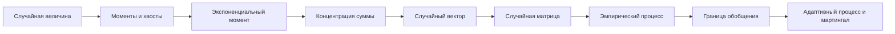

# Теория вероятностей и концентрация меры — карта курса

Курс строит вероятностный фундамент для [[30_mathematics/random-matrix-theory/random-matrix-theory-map|теории случайных матриц]], статистического риска, ядровых методов и диагностики современных моделей ИИ. Центральная идея: недостаточно знать математическое ожидание случайной величины — нужно количественно понимать, насколько отдельное наблюдение или алгоритм отклоняется от типичного поведения.

## Маршрут курса

### Готовые блоки на ревью

1. [[30_mathematics/probability/modules/01-probability-refresher|Вероятностный минимум: случайность, ожидание и условие]].
2. [[30_mathematics/probability/modules/02-concentration-independent-sums|Концентрация сумм независимых величин]].
3. [[30_mathematics/probability/modules/03-random-vectors-high-dimensions|Случайные векторы в высокой размерности]].
4. [[30_mathematics/probability/modules/04-random-matrices|Случайные матрицы, ε-сети и операторная норма]].
5. [[30_mathematics/probability/modules/05-concentration-without-independence|Концентрация без независимости]].
6. [[30_mathematics/probability/modules/06-quadratic-forms-symmetrization|Квадратичные формы, симметризация и принцип сжатия]].
7. [[30_mathematics/probability/modules/07-random-processes-gaussian-width|Случайные процессы и гауссовская ширина]].
8. [[30_mathematics/probability/modules/08-chaining-empirical-processes|Цепочки, эмпирические процессы и VC-размерность]].
9. [[30_mathematics/probability/modules/09-matrix-deviations-sparse-recovery|Матричные отклонения и разреженное восстановление]].
10. [[30_mathematics/probability/modules/10-martingales-adaptive-concentration|Условное ожидание, мартингалы и концентрация адаптивных процессов]].

## Ключевые самостоятельные результаты

- [[30_mathematics/probability/theorems/hoeffding-inequality|Неравенство Хёффдинга]]: ограниченные независимые вклады.
- [[30_mathematics/probability/theorems/bernstein-inequality|Неравенство Бернштейна]]: гауссовский режим малых отклонений и экспоненциальный режим больших.
- [[30_mathematics/probability/theorems/subgaussian-norm-concentration|Концентрация нормы субгауссовского вектора]]: эффект тонкого слоя.
- [[30_mathematics/probability/theorems/subgaussian-matrix-operator-norm|Операторная норма субгауссовской матрицы]]: равномерный контроль всех направлений.
- [[30_mathematics/probability/theorems/sphere-lipschitz-concentration|Концентрация липшицевых функций на сфере]]: геометрический механизм без независимости координат.
- [[30_mathematics/probability/theorems/hanson-wright-inequality|Неравенство Хансона—Райта]]: два масштаба квадратичного хаоса.
- [[30_mathematics/probability/theorems/dudley-integral-inequality|Интегральное неравенство Дадли]]: многошкальная оценка супремума.
- [[30_mathematics/probability/theorems/vc-uniform-law-large-numbers|Равномерный закон больших чисел для VC-класса]]: сложность выбора модели.
- [[30_mathematics/probability/theorems/matrix-deviation-inequality|Матричное неравенство об отклонении]]: равномерное сохранение структурированного множества.
- [[30_mathematics/probability/theorems/azuma-hoeffding|Неравенство Адзумы—Хёффдинга]]: концентрация последовательности с условно центрированными ограниченными приращениями.

## Главная цепочка идей

## Явные переносы в ИИ

- [[50_bridges/concentration-generalization-auditing|Концентрация → обобщение и аудит конечной выборки]].
- [[50_bridges/thin-shell-embedding-geometry|Тонкий слой → геометрия эмбеддингов]].
- [[50_bridges/random-projections-retrieval|Случайные проекции → сжатие геометрии и поиск похожих объектов]].
- [[50_bridges/quadratic-forms-covariance-anomaly|Квадратичные формы → ковариационные оценки и обнаружение аномалий]].
- [[50_bridges/gaussian-width-sample-complexity|Гауссовская ширина → эффективная сложность и объём данных]].
- [[50_bridges/empirical-processes-adaptive-generalization|Эмпирические процессы → равномерное и адаптивное обобщение]].
- [[50_bridges/structured-recovery-low-rank-adaptation|Структурированное восстановление → сжатые измерения и низкоранговая адаптация]].
- [[50_bridges/generalization-complexity-ai|Сложность класса → диагностика обобщения]].
- [[50_bridges/rmt-spectral-diagnostics|Высокоразмерная вероятность → спектральная диагностика]].

## Как читать вероятностную гарантию

Для каждого результата фиксируются:

1. источник случайности;
2. независимость или иной вид зависимости;
3. масштаб хвостов;
4. величина, относительно которой измеряется отклонение;
5. вероятность отказа;
6. способ выбора модели после просмотра данных.

Если хотя бы один пункт не определён, формула концентрации ещё не является гарантией для системы ИИ.

## Источник

- [[60_sources/vershynin-high-dimensional-probability|Роман Вершинин — High-Dimensional Probability, 2-е издание]].
- [[60_sources/tao-epsilon-of-room|Теренс Тао — контекст мартингальной концентрации]].
- [[30_mathematics/probability/probability-source-map|Карта всех разделов источника]].
