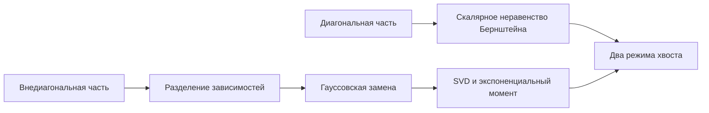

# Неравенство Хансона—Райта

## Зачем это нужно

Неравенство Хансона—Райта контролирует случайную энергию $X^TAX$. Оно является квадратичным аналогом неравенства Бернштейна и объясняет, почему у квадратичной статистики одновременно возникают «многомерный» и «однонаправленный» режимы отклонения.

## Формулировка

Пусть $A\in\mathbb R^{n\times n}$, а

$$
X=(X_1,\ldots,X_n)
$$

имеет независимые центрированные субгауссовские координаты. Обозначим

$$
K=\max_i\|X_i\|_{\psi_2}.
$$

Тогда для каждого $t\ge0$

$$
\boxed{
\mathbb P\{
|X^TAX-\mathbb EX^TAX|\ge t
\}
\le
2\exp\left[
-c\min\left(
\frac{t^2}{K^4\|A\|_F^2},
\frac{t}{K^2\|A\|}
\right)
\right].
}
$$

## Пререквизиты и карта доказательства



## Интуиция двух масштабов

- $\|A\|_F$ суммирует энергию всех направлений и управляет умеренными отклонениями.
- $\|A\|$ выделяет наиболее усиливаемое направление и управляет далёким хвостом.

Аналогичная смена режима уже возникала в [[30_mathematics/probability/theorems/bernstein-inequality|неравенстве Бернштейна]].

## Доказательство

Масштабированием достаточно рассмотреть $K=1$. Для нижнего хвоста заменим $A$ на $-A$, поэтому разберём верхний.

### Шаг 1. Диагональная и внедиагональная части

Так как координаты независимы и центрированы,

$$
X^TAX-\mathbb EX^TAX
=
\sum_i a_{ii}(X_i^2-\mathbb EX_i^2)
+
\sum_{i\ne j}a_{ij}X_iX_j.
$$

Вероятность отклонения не менее $t$ ограничивается суммой вероятностей, что одна из частей превосходит $t/2$.

### Шаг 2. Диагональная часть

Квадрат субгауссовской величины субэкспоненциален:

$$
\|X_i^2-\mathbb EX_i^2\|_{\psi_1}
\le C.
$$

Неравенство Бернштейна даёт

$$
\mathbb P\left\{
\left|\sum_i a_{ii}(X_i^2-\mathbb EX_i^2)\right|
\ge t/2
\right\}
\le
2\exp\left[
-c\min\left(
\frac{t^2}{\sum_i a_{ii}^2},
\frac{t}{\max_i|a_{ii}|}
\right)
\right].
$$

Используем

$$
\sum_i a_{ii}^2\le\|A\|_F^2,
\qquad
\max_i|a_{ii}|\le\|A\|.
$$

### Шаг 3. Разделение внедиагональной части

Пусть $X'$ — независимая копия $X$. Для матрицы без диагонали разделение даёт сравнение экспоненциальных моментов

$$
\mathbb E\exp\left(
\lambda\sum_{i\ne j}a_{ij}X_iX_j
\right)
\le
\mathbb E\exp(4\lambda X^TAX').
$$

В правой части две группы координат независимы.

### Шаг 4. Гауссовская замена

Субгауссовский экспоненциальный момент линейной формы позволяет последовательно заменить $X$ и $X'$ независимыми стандартными гауссовскими векторами $g,g'$:

$$
\mathbb E e^{\lambda X^TAX'}
\le
\mathbb E e^{C\lambda g^TAg'}.
$$

Цена замены поглощается абсолютной константой.

### Шаг 5. Экспоненциальный момент гауссовской формы

Пусть

$$
A=U\Sigma V^T
$$

— сингулярное разложение, а $s_i$ — сингулярные числа. Вращательная инвариантность даёт

$$
g^TAg'
\overset{d}=
\sum_i s_i g_i g_i'.
$$

Слагаемые независимы, и при

$$
|\lambda|\le\frac{1}{2\|A\|}
$$

получаем

$$
\mathbb E e^{\lambda g^TAg'}
\le
\exp(\lambda^2\|A\|_F^2).
$$

Здесь использованы тождества

$$
\sum_i s_i^2=\|A\|_F^2,
\qquad
\max_i s_i=\|A\|.
$$

### Шаг 6. Оптимизация параметра

Неравенство Маркова приводит к

$$
\mathbb P\left\{
\sum_{i\ne j}a_{ij}X_iX_j\ge t/2
\right\}
\le
\exp\left(
-\lambda t/2+C\lambda^2\|A\|_F^2
\right)
$$

при $\lambda\le c/\|A\|$.

Оптимальный допустимый порядок

$$
\lambda
\asymp
\min\left(
\frac{t}{\|A\|_F^2},
\frac1{\|A\|}
\right)
$$

даёт

$$
\exp\left[
-c\min\left(
\frac{t^2}{\|A\|_F^2},
\frac{t}{\|A\|}
\right)
\right].
$$

Объединяя диагональную и внедиагональную части, возвращая $K$ и суммируя два хвоста, получаем утверждение.

## Контрпример без независимости координат

Пусть

$$
X=\zeta\mathbf1_n,
\qquad
\zeta\sim N(0,1),
\qquad
A=I.
$$

Каждая координата центрирована и субгауссовская, но координаты полностью зависимы. Тогда

$$
X^TAX=n\zeta^2,
\qquad
X^TAX-\mathbb EX^TAX=n(\zeta^2-1).
$$

Типичное отклонение имеет порядок $n$, тогда как формальная подстановка

$$
\|I\|_F=\sqrt n,
\qquad
\|I\|=1
$$

предсказала бы масштаб $\sqrt n$. Независимость координат существенна.

## Вычислительная форма

Для порога доверия порядка $1-\delta$ удобно решать хвостовую границу по $t$:

$$
t
\lesssim
K^2\left(
\|A\|_F\sqrt{\log(2/\delta)}
+
\|A\|\log(2/\delta)
\right).
$$

Это даёт интерпретируемую сумму умеренного и экстремального допусков.

```python
import numpy as np

def hanson_wright_scale(A, delta, K=1.0):
    u = np.log(2.0 / delta)
    return K**2 * (
        np.linalg.norm(A, "fro") * np.sqrt(u)
        + np.linalg.norm(A, 2) * u
    )
```

## Перенос в ИИ

- **`established`**: при заявленных предпосылках граница применима к квадратичным оценкам энергии и ковариации.
- **`analogy`**: $\|A\|_F$ описывает распределённый шум, а $\|A\|$ — узкий резонансный канал.
- **`research hypothesis`**: разложение фактических отклонений на эти два масштаба может различать массовый дрейф и локальный спектральный выброс в представлениях.

Практический разбор: [[50_bridges/quadratic-forms-covariance-anomaly|квадратичные формы, ковариация и аномалии]].

## Визуализация


## Упражнения

1. Получите неравенство для $A=I$ и сравните его с концентрацией нормы.
2. Найдите два масштаба для ранга-один матрицы $A=uu^T$.
3. Объясните роль независимой копии $X'$.
4. Проверьте контрпример с общей гауссовской амплитудой численно.

## Источники

- [[60_sources/vershynin-high-dimensional-probability|Роман Вершинин, High-Dimensional Probability]], теорема 6.2.2 и доказательство, с. 175–179.
- [[30_mathematics/probability/modules/06-quadratic-forms-symmetrization|Модуль о квадратичных формах и симметризации]].
