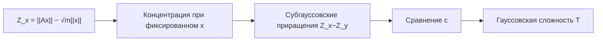

# Матричное неравенство об отклонении на множестве

## Зачем это нужно

Теорема контролирует действие одной случайной матрицы одновременно на всём структурированном множестве. Она объединяет концентрацию нормы, случайные проекции, оценивание ковариации и геометрию обратных задач.

## Формулировка

Пусть $A\in\mathbb R^{m\times n}$ имеет независимые изотропные субгауссовские строки $A_i$:

$$
\mathbb EA_iA_i^T=I_n,
\qquad
K=\max_i\|A_i\|_{\psi_2}.
$$

Тогда для любого ограниченного $T\subset\mathbb R^n$

$$
\boxed{
\mathbb E
\sup_{x\in T}
\left|
\|Ax\|_2-\sqrt m\|x\|_2
\right|
\le
CK^2\gamma(T),
}
$$

где

$$
\gamma(T)
=
\mathbb E\sup_{x\in T}|\langle g,x\rangle|,
\qquad
g\sim N(0,I_n).
$$

Высоковероятностная версия:

$$
\sup_{x\in T}
\left|
\|Ax\|_2-\sqrt m\|x\|_2
\right|
\le
CK^2\left[
w(T)+u\,\operatorname{rad}(T)
\right]
$$

с вероятностью не менее $1-2e^{-u^2}$, с точностью до выбора эквивалентной версии ширины.

## Карта доказательства



## Ключевая лемма

Процесс

$$
Z_x
=
\|Ax\|_2-\sqrt m\|x\|_2
$$

имеет субгауссовские приращения:

$$
\boxed{
\|Z_x-Z_y\|_{\psi_2}
\le
CK^2\|x-y\|_2.
}
$$

После этого неравенство сравнения Талаграна переводит процесс $Z_x$ в канонический гауссовский процесс.

## Подробный план доказательства приращений

### Шаг 1. Единичный вектор и ноль

Для $\|x\|_2=1$:

$$
\|Ax\|_2^2
=
\sum_{i=1}^m\langle A_i,x\rangle^2.
$$

Координаты независимы, субгауссовские и имеют вторые моменты $1$ по изотропности. Концентрация нормы даёт

$$
\left\|
\|Ax\|_2-\sqrt m
\right\|_{\psi_2}
\le
CK^2.
$$

### Шаг 2. Два единичных вектора и квадраты норм

Для $\|x\|_2=\|y\|_2=1$:

$$
\|Ax\|_2^2-\|Ay\|_2^2
=
\sum_{i=1}^m
\langle A_i,x+y\rangle
\langle A_i,x-y\rangle.
$$

После деления на $\|x-y\|_2$ получаем сумму независимых центрированных субэкспоненциальных величин. Их $\psi_1$-масштаб не превосходит $CK^2$. Неравенство Бернштейна контролирует разность квадратов.

### Шаг 3. Возврат от квадратов к нормам

Используем

$$
|a-b|
=
\frac{|a^2-b^2|}{a+b}.
$$

С высокой вероятностью $\|Ax\|_2$ и $\|Ay\|_2$ имеют порядок $\sqrt m$. Маловероятный случай малой нормы отдельно контролируется шагом 1. Это даёт

$$
\|\|Ax\|_2-\|Ay\|_2\|_{\psi_2}
\le
CK^2\|x-y\|_2
$$

для единичных $x,y$.

### Шаг 4. Произвольные векторы

Нормируем один вектор и проецируем другой на единичную сферу. Однородность $Z_{\lambda x}=|\lambda|Z_x$ и геометрическая оценка для трёх точек переводят единичный случай в общий:

$$
\|Z_x-Z_y\|_{\psi_2}
\le
CK^2\|x-y\|_2.
$$

### Шаг 5. Сравнение процессов

Канонический гауссовский процесс

$$
G_x=\langle g,x\rangle
$$

имеет приращения масштаба $\|x-y\|_2$. Теорема сравнения для субгауссовских процессов даёт

$$
\mathbb E\sup_{x\in T}|Z_x|
\le
CK^2
\mathbb E\sup_{x\in T}|\langle g,x\rangle|
=
CK^2\gamma(T).
$$

## Контрпример без изотропности

Пусть каждая строка имеет вид

$$
A_i=\sqrt n\,\varepsilon_i e_1.
$$

Она центрирована и ограничена, но

$$
\mathbb EA_iA_i^T
=
n e_1e_1^T\ne I.
$$

Для $x=e_2$

$$
\|Ax\|_2=0,
\qquad
\sqrt m\|x\|_2=\sqrt m.
$$

Ошибка систематична и не исчезает с ростом $m$. Концентрация не исправляет неверную геометрию среднего оператора.

## Вычислительная форма

Для конечного $T$ можно оценить

$$
\max_{x\in T}
\left|
\|Ax\|_2/\sqrt m-\|x\|_2
\right|
$$

и сравнить с методом Монте-Карло для $\gamma(T)/\sqrt m$.

```python
import numpy as np

rng = np.random.default_rng(89)
m, n, N = 300, 500, 3000
T = rng.normal(size=(N, n))
T /= np.linalg.norm(T, axis=1, keepdims=True)
A = rng.normal(size=(m, n))

deviation = np.max(np.abs(np.linalg.norm(T @ A.T, axis=1) - np.sqrt(m)))
print(deviation)
```

## Перенос в ИИ

- **`established`**: теорема контролирует случайные линейные измерения на фиксированном структурированном множестве.
- **`analogy`**: гауссовская сложность — стоимость одновременного контроля всех допустимых направлений.
- **`research hypothesis`**: локальная сложность множества допустимых обновлений может прогнозировать устойчивость случайных эскизов градиента или низкоранговой адаптации.

## Визуализация


## Упражнения

1. Выведите результат для $T=S^{n-1}$ и сравните с оценками сингулярных чисел.
2. Почему $K$ входит в квадрате?
3. Где в доказательстве используется независимость строк?
4. Проверьте контрпример без изотропности.

## Источники

- [[60_sources/vershynin-high-dimensional-probability|Роман Вершинин, High-Dimensional Probability]], теоремы 9.1.1–9.1.2, с. 263–267.
- [[30_mathematics/probability/modules/09-matrix-deviations-sparse-recovery|Модуль о матричных отклонениях и восстановлении]].
