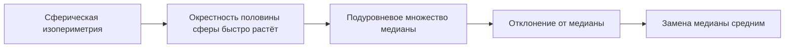

# Концентрация липшицевых функций на сфере

## Зачем это нужно

Теорема показывает, что независимость координат не является необходимой для концентрации. Равномерная точка сферы имеет зависимые координаты, но любая нечувствительная к малым перемещениям наблюдаемая почти постоянна на большей части сферы.

## Формулировка

Пусть

$$
X\sim\operatorname{Unif}(\sqrt n\,S^{n-1})
$$

и $f\colon\sqrt n\,S^{n-1}\to\mathbb R$ — липшицева функция относительно евклидовой метрики. Тогда

$$
\boxed{
\|f(X)-\mathbb Ef(X)\|_{\psi_2}
\le
C\|f\|_{\mathrm{Lip}}
}
$$

или, эквивалентно, для каждого $t\ge0$:

$$
\boxed{
\mathbb P\{|f(X)-\mathbb Ef(X)|\ge t\}
\le
2\exp\left(
-c\frac{t^2}{\|f\|_{\mathrm{Lip}}^2}
\right).
}
$$

## Карта доказательства



## Геометрическая интуиция

Возьмём множество точек, где $f$ не превосходит медиану. Оно занимает не менее половины сферы. Изопериметрия говорит, что небольшая окрестность этого множества покрывает почти всю сферу. Липшицевость переводит близость к подуровневому множеству в ограничение $f\le M+t$.

## Доказательство

Нормировкой можно считать $\|f\|_{\mathrm{Lip}}=1$.

### Шаг 1. Подуровневое множество медианы

Пусть $M$ — медиана $f(X)$ и

$$
A=\{x\in\sqrt nS^{n-1}:f(x)\le M\}.
$$

По определению медианы

$$
\sigma(A)\ge\frac12.
$$

### Шаг 2. Раздувание множества

Сферическая изопериметрия приводит к оценке для $t$-окрестности:

$$
\sigma(A_t)
\ge
1-2e^{-ct^2}.
$$

Смысл: почти каждая точка сферы находится на расстоянии не более $t$ от $A$.

### Шаг 3. Перевод расстояния в значение функции

Если $x\in A_t$, существует $y\in A$ такое, что $\|x-y\|_2\le t$. Поскольку $f$ 1-липшицева,

$$
f(x)
\le
f(y)+\|x-y\|_2
\le
M+t.
$$

Поэтому

$$
\mathbb P\{f(X)>M+t\}
\le
2e^{-ct^2}.
$$

### Шаг 4. Нижний хвост

Применяем тот же аргумент к $-f$:

$$
\mathbb P\{f(X)<M-t\}
\le
2e^{-ct^2}.
$$

После изменения абсолютных констант

$$
\mathbb P\{|f(X)-M|\ge t\}
\le
2e^{-c't^2}.
$$

### Шаг 5. От медианы к среднему

Интегрирование хвоста показывает

$$
|\mathbb Ef(X)-M|
\le C.
$$

Сдвиг центра на ограниченную величину сохраняет субгауссовский масштаб. Возвращая $\|f\|_{\mathrm{Lip}}$, получаем теорему.

## Контрпример при неверном распределении

Пусть $X$ принимает значения $\pm\sqrt n\,e_1$ с равными вероятностями и

$$
f(x)=x_1.
$$

Функция 1-липшицева, но

$$
|f(X)-\mathbb Ef(X)|=\sqrt n
$$

с вероятностью $1$. Значит, одной липшицевости недостаточно: равномерная сферическая мера и её изопериметрия существенны.

## Вычислительная форма

```python
import numpy as np

rng = np.random.default_rng(59)
n, samples = 500, 50_000
X = rng.normal(size=(samples, n))
X *= np.sqrt(n) / np.linalg.norm(X, axis=1, keepdims=True)

f = np.max(X[:, :20], axis=1)
print(np.mean(f), np.std(f), np.quantile(f, [0.01, 0.99]))
```

Функция максимума первых координат 1-липшицева. Эксперимент иллюстрирует концентрацию, но не оценивает универсальные константы.

## Перенос в ИИ

- **`established`**: липшицевы статистики сферических и гауссовских случайных объектов концентрируются при соответствующих мерах.
- **`analogy`**: нормированные представления лежат на сфере, а нечувствительная метрика должна мало меняться на типичной области.
- **`research hypothesis`**: эмпирическая концентрация локально липшицевых оценок может быть диагностикой стабильности слоя, но распределение реальных представлений обычно неравномерно и анизотропно.

## Режим отказа

Нормировка векторов на единичную длину не делает их равномерными на сфере. Кластеры, анизотропия и низкоразмерная поддержка меняют меру, поэтому сферическую границу нельзя применять только по факту $\|X\|_2=\mathrm{const}$.

## Визуализация


## Упражнения

1. Проверьте, что линейная функция $f(x)=\langle a,x\rangle$ имеет константу Липшица $\|a\|_2$.
2. Покажите включение $A_t\subseteq\{f\le M+t\}$.
3. Постройте пример неравномерной меры на сфере с плохой концентрацией.
4. Объясните, почему размерность не входит явно в хвост для сферы радиуса $\sqrt n$.

## Источники

- [[60_sources/vershynin-high-dimensional-probability|Роман Вершинин, High-Dimensional Probability]], теорема 5.1.3 и доказательство, с. 142–146.
- [[30_mathematics/probability/modules/05-concentration-without-independence|Модуль о концентрации без независимости]].
