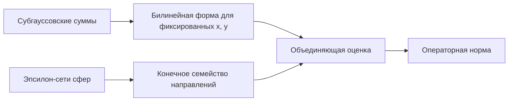

# Операторная норма субгауссовской случайной матрицы

## Зачем это нужно

Теорема превращает контроль каждого элемента матрицы в равномерный контроль действия матрицы на все направления. Она задаёт естественный спектральный масштаб чистого шума и тем самым отделяет устойчивый сигнал от случайного фона.

## Пререквизиты и зависимости



## Формулировка

Пусть $A\in\mathbb R^{m\times n}$ — случайная матрица с независимыми центрированными субгауссовскими элементами. Обозначим

$$
K=\max_{i,j}\|A_{ij}\|_{\psi_2}.
$$

Тогда для любого $t>0$

$$
\boxed{
\|A\|
\le
CK(\sqrt m+\sqrt n+t)
}
$$

с вероятностью не менее

$$
1-2e^{-t^2},
$$

где $C>0$ — абсолютная константа.

## Область применимости

- элементы центрированы;
- элементы независимы;
- все элементы имеют конечную субгауссовскую норму;
- оценивается евклидова операторная норма $2\to2$.

Независимость можно ослаблять в специальных версиях, но это уже другое утверждение с отдельно проверяемыми условиями.

## Геометрическая интуиция

Операторная норма — максимальное растяжение единичной сферы. Чтобы не проверять все направления, мы покрываем входную и выходную сферы конечными сетями. Для каждой пары узлов сети билинейная форма имеет субгауссовский хвост. Экспоненциальный хвост компенсирует экспоненциальное число пар.

## Доказательство

### Шаг 1. Билинейное представление

$$
\|A\|
=
\sup_{x\in S^{n-1},\,y\in S^{m-1}}
|\langle Ax,y\rangle|.
$$

Выберем $1/4$-сети $\mathcal N\subset S^{n-1}$ и $\mathcal M\subset S^{m-1}$. Их мощности можно ограничить:

$$
|\mathcal N|\le9^n,
\qquad
|\mathcal M|\le9^m.
$$

Лемма о приближении нормы по сетям даёт

$$
\|A\|
\le
2\max_{x\in\mathcal N,\,y\in\mathcal M}
|\langle Ax,y\rangle|.
$$

### Шаг 2. Концентрация для фиксированной пары

Зафиксируем $x$ и $y$. Тогда

$$
\langle Ax,y\rangle
=
\sum_{i=1}^m\sum_{j=1}^n A_{ij}x_jy_i.
$$

Это сумма независимых центрированных субгауссовских величин. Её субгауссовский масштаб удовлетворяет

$$
\|\langle Ax,y\rangle\|_{\psi_2}^2
\le
C\sum_{i,j}\|A_{ij}x_jy_i\|_{\psi_2}^2
\le
CK^2
\sum_{i,j}x_j^2y_i^2.
$$

Поскольку $\|x\|_2=\|y\|_2=1$,

$$
\sum_{i,j}x_j^2y_i^2
=
\left(\sum_jx_j^2\right)
\left(\sum_iy_i^2\right)
=1.
$$

Следовательно,

$$
\mathbb P\{
|\langle Ax,y\rangle|\ge u
\}
\le
2\exp\left(-c\frac{u^2}{K^2}\right).
$$

### Шаг 3. Объединяющая оценка

Для всех пар сети:

$$
\mathbb P\left\{
\max_{x\in\mathcal N,y\in\mathcal M}
|\langle Ax,y\rangle|
\ge u
\right\}
\le
2\cdot9^{n+m}
\exp\left(-c\frac{u^2}{K^2}\right).
$$

### Шаг 4. Выбор порога

Положим

$$
u=C_1K(\sqrt m+\sqrt n+t).
$$

Тогда

$$
\frac{u^2}{K^2}
\ge
C_1^2(m+n+t^2).
$$

При достаточно большом $C_1$ отрицательная экспонента поглощает множитель $9^{m+n}$:

$$
\mathbb P\left\{
\max_{\mathcal N,\mathcal M}
|\langle Ax,y\rangle|\ge u
\right\}
\le2e^{-t^2}.
$$

### Шаг 5. Возврат к непрерывной сфере

По сеточной оценке

$$
\|A\|\le2u.
$$

Поглощая множитель $2$ в абсолютную константу $C$, получаем заявленную границу.

## Контрпример без центрирования

Пусть

$$
A_{ij}=1+\varepsilon_{ij},
$$

где $\varepsilon_{ij}$ — независимые знаки Радемахера. Тогда

$$
A=\mathbf1_m\mathbf1_n^T+E.
$$

У детерминированной части

$$
\|\mathbf1_m\mathbf1_n^T\|=\sqrt{mn},
$$

что существенно больше $\sqrt m+\sqrt n$ для больших квадратных матриц. Центрирование исключает такую скрытую ранговую компоненту.

## Вычислительная форма

Для численной диагностики сравнивают

$$
\frac{\|A-\mathbb EA\|}{\sqrt m+\sqrt n}
$$

между размерами и распределениями. Стабильность отношения поддерживает предполагаемый масштаб, но не доказывает субгауссовские хвосты.

```python
import numpy as np

rng = np.random.default_rng(53)
for n in (100, 300, 900):
    A = rng.choice((-1.0, 1.0), size=(n, n))
    ratio = np.linalg.norm(A, 2) / (2 * np.sqrt(n))
    print(n, ratio)
```

## Перенос в ИИ

- **`established`**: для подходящих случайных матриц теорема ограничивает максимальное усиление линейного отображения.
- **`analogy`**: спектральная норма играет роль худшего коэффициента усиления шума во всех направлениях.
- **`research hypothesis`**: превышение теоретического шумового масштаба в якобиане слоя может указывать на структурированный сигнал или нестабильность; различение этих причин требует отдельного анализа.

## Визуализация


## Упражнения

1. Выведите нижнюю оценку $\|A\|\ge\max_j\|Ae_j\|_2$.
2. Проверьте, как меняется мощность сети при другом $\varepsilon$.
3. Постройте зависимую матрицу $A_{ij}=\xi$ и сравните её норму с масштабом теоремы.
4. Объясните, почему теорема не даёт нижнюю границу на $s_{\min}(A)$.

## Источники

- [[60_sources/vershynin-high-dimensional-probability|Роман Вершинин, High-Dimensional Probability]], теорема 4.4.3, с. 118–119.
- [[30_mathematics/probability/modules/04-random-matrices|Модуль о случайных матрицах]].
